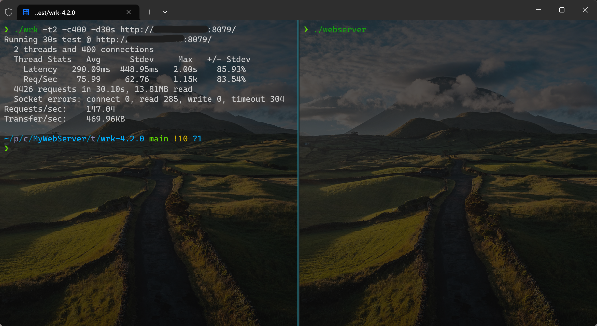
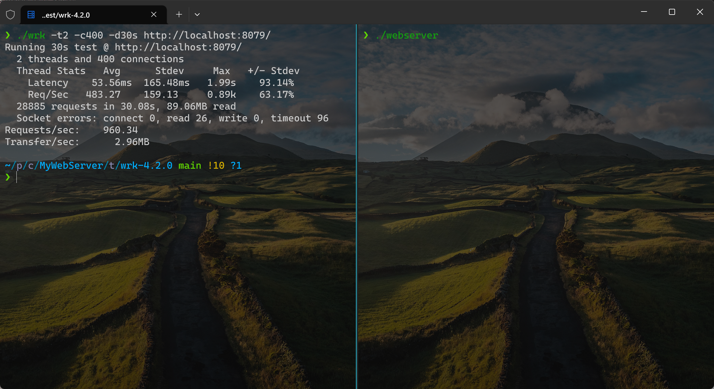

# MyWebServer
C++ WebServer 实战项目。

## 结构说明
结构图如下，也可以点击[此](https://viewer.diagrams.net/?tags=%7B%7D&highlight=0000ff&edit=_blank&layers=1&nav=1&title=WebServer%E7%BB%93%E6%9E%84%E5%9B%BE.drawio#R7V1tb6O4Fv41SLsrJcIYG%2FMR0uTOSh3d7vRKs%2FNpRYOT5g4NLSHT9v76axtIIDYNbTDQtNVqJxjbgM%2Fxc158fGzAyd3Tv5Lg%2FvZrHNLIsMzwyYAXhmUBDAH7h5c8ZyUusbOCZbIK80r7guvV%2F2heaOal21VIN5WKaRxH6eq%2BWjiP12s6TytlQZLEj9VqiziqPvU%2BWFKp4HoeRHLp91WY3malxHL25V%2FoanlbPBlgN7tzFxSV8y%2FZ3AZh%2FFgqglMDTpI4TrNfd08TGvHBK8Ylazerubt7sYSu0yYNEm%2FkTR7o9228jJzl5a%2BHeRCM8l5%2BBdE2%2F%2BD8ZdPnYgSSeLsOKe%2FENKD%2FeLtK6fV9MOd3HxnNWdltehexK8B%2BhsHmVtQtLq6CNKXJmpUQ1i1hpZs0iX%2FSSRzFiXgAdKYenvK%2BF6soKsrX8ZruKhcjD1lJ%2FsI0SelT7UiA3fgyxqTxHU2TZ1YlbwCJOcb5h%2BZsCd2cSo97IkOcl92WCGwXFYOcsZa77vdjz37kw%2F8KUlgKUuAo5eMSs%2B8q0wQ%2FbOPixmgj5ozHKrAxeBIjVNxnv5bi3yky%2FIlBLGOKDe%2FC8JAxdQ0CDY%2FwW4QYBBcPY%2B%2BePS9vehI71FL0oLAFotoQHRLVAUgiqoqmGGkiKZRGj4YMXfLLOElv42W8DqLpvtSvju%2B%2BzmUc3%2Bej%2Bl%2Baps85VAbbNK6OOX1apX%2Fz5mOUX%2F0o3bl4ynsWF8%2F5Rfae%2FOVeO%2FoJjYJ09avaTjWQedOreCWYuaCahSWqkQNybOJtMqd5wzLAvaGvNEiWNJX6EtTdfdUJBLd7pXiJ3nvqqynO6Jo8%2F110wC9Krfjlvpm4ei2nsDEQZHthsPKxykjyQj1ka2E9x5IAA5jA7JRfEDwZ9IFdA%2FqPCYPmy3jZFNg5TS%2BDG6a%2FVZgriFZLLr7njL6UQbbPUXrFFCQvv3G3CsOMjyl7q%2BBG9MdZ5Z6PmhhH5Bvo4iWYz7W3vPFeZyqz1QsTrlYomGOLoAMaZ1cnMs%2FIqvY6OughXiw2VAvL2BLHCBq3LKUrepyksc1mJvvTpZ4hRjZwgOOOrJ4RhSQnupQzKOvFAxXlO2AvYfmPCpRrB3bUENhPxfWTKGr3S9GKqLYayuoDkoIjJN0wCqQeN4I5fkfBZrOaF8WzVVS8U5siHTYkPXTakOns24LnUoVc4tSitoUkww855gErZZ22i9muPjG%2FWq%2FSCROfZy3ms8laKzFGTGAAHVK%2BsBYLKQ87E%2FNIwTGdyvgJ9PwLbTLeNqWZaNsKF4ylEPKWrUvK414GvTy09WRoY9Bt2UUijzl2VWOuTbMCTr%2BalVVWrXaid6g2M2koX8Gp7prTaKpR3i1Cdpe35I3NaLVJ6XoWnrX0AzXK0s7IRSZyWxF4VlWK2gfeM33ibrdIMgBtfPCOs6YgYLltKNkSk2AiiZGdHOnIb1a8tA6ASWggIMaZ8P%2BYaOR%2BtLPGl9JypBpfIIa4qgjbrcANsKtw0xna9OqmB29BG%2FN1aEPXoWz4s8KS2d%2B9d6AxbtVYex0pLybpVyN9k6%2FPtp3XePvE1RVNVmzMOCD1pqeapzqCTqI1OV2MoNo1d9vwieGzH47he4Y%2F4z88YhC%2FeMZNspcjGhbfawVFc4vRwa4k6olsMgKVmY61WYxtB60cjTuxVJY5%2F5vNWrLMHUmlUgSkKIMXwOGSZXsBKQMKX2homPe35lEsWA1duFmnIx6uQbz%2FMGGSjIMw%2FO137cFEbP6FiJLQVrvUStWIdQMxVk7pNiauqwgiUKxVEnniavNighaCCupoTO%2FjKBqxq%2BCOU0eUMYrPPhLNsQmb0BwUYqkbopu9onUXNs3mNrjnb7GI6FNut7SJ4AW5GuisvUJ48Z46fB8CwjuZyAEli%2FnRiYznhN4spInc0iIUMLHsyVLoXbZC7dI2kYvIch3knUcrNjT%2F8CVj2Qa5YyQrcD3KVpZZLe4B%2B5Km9%2FkScwn2uY9MPE545EfSzVKrLqyd1iUFf7UCPc02VAVij6FTFRtIoeTb1hh1yG%2BwX8%2F7%2B4psstyGMgL1KSFgC97xOgWQ7yBwseGb9W6Ns%2FSRw5d95CNzDM0imvetXvEOHN8tLMzWmn%2B3fOXkKo6jrraS9Bmkast7iCwibzcBKpcN0oblGi2%2FP8ZR81jyQlWfP0crRuIEHqfvTcYMlze7gmD%2BcylY5N%2FblHVDC0JnMgUgWejfmBRSrGIGkxKTkJbURiRpjVghyFWU1xef3Ha8mEIfkiegnsHc7bsrzyNVUBLQNpHsnpUip7lW1HAZr6Q8OX1pT8UickfRwYrwX8ZqZukPVfgOHbKT5iAGW2MQA3vv8w8KPha2wGC%2FGmAwOlFBK7rB1Rb69DWoikhtSaBfP0ScRTpR2E72%2BLTkugXyOhtUhMDuBEs3Fng%2F8QZ7gWC9alfJm0Jn25QiTlMpgrVIEZmFpJwANTuWW0MFjeG18yje0LMXHdmUe8maR6hI5FGAvtWO7Chi3joQHi14ko8Ij2%2Fen39%2BZOFhq0yVToWH3bfweJUxoQw7a2rBvCFYu0Wx03hro63HeIFyfhPJYKmRO6%2FdJglN%2BVGkg22SxefokGsPW8pH94xlmv2yTDPH0CoWBloyhwp2qXRqdWYc2Tq9nV9%2FXP91ORRHtuvC%2FebAtiOYgDzZFVJNlW1Bn1DTqLlcBGkgL0n7wabxHo%2Bzdm4rzJvendtI63omMnxHZESzDf%2FCcCcvx2srHnUTJ4wLRvOMIJ540eS30ahc%2FnvNwzF%2FILkQWdg8wwMTEaEx1HBwjhWkGsKg1IChy53MHTII6kUJbjFS%2BajTRfN%2BDdQ0GVe2xNhb%2BLIJhkNpPdEqmqMcGxM6D2nti9LFe%2BrAfD%2BK5z%2F%2F2tJtY5F%2Fiu%2FiBoThwjyq5QHTgS7V5ruAUvCZ4%2B4CzcrYbSrDz6CuFJloQJvtBr%2FJBDVdQEW97qpz%2Bs2CeaY0dXqVvKiD3DhyZuiZaYotdnII1wuJpgHH%2FnZgE8ueMFthDe22f1RS5li61F08oPk1%2BJBd1HS5EJ2aLeM0mg7IhDkfmuJeMRPjT5pqoGmvqa1wz%2BnKzpSmVq%2B6jUZ38zf6sKUb3sdVkOx9zKXNUFNieDPug5xiwwfikAZW4hgeFO7BqcGjS97DhqkW9C0iL0bYig15ACtMVG3BwHhAJmrDKX%2BQm8w5trW2zTnfdIuUeyqOv2ltW8FhxfpG3bkSjrzy%2FoYmKHdS611B1xgZliPZJV%2Bs%2Bih45MirYUiR%2F0a1OKoNjop41UEkTB0%2BHmEwaDxyLXLGeFQMvg48%2BkKDsKNkBUOAIlcRp6GAIlXwoT4okn2An5rRESNnuEgkpzI6JySy9CGRH4eNQwvfPw41U4lUOVP0WWjuJw69AoeaRjL3ZKHJ6aXPCYc0nvh2xY%2Bc%2FSg4ROTcTb3jkPPp8G8OQ05TGHJ6TabjaIwy%2F0Y39%2FFa7RV2DNc23Bn3ARPCfcBTZLgwjxX1PX73o0x1YMoioX%2B3MBlQetzhT%2FamZwI6NbtYOsoH%2FrkKr4OmrZxD8lo9EgDsvFYrBJYt5XY9aKNHLQTmZ0yPDs7rNw5SlZSpJV3%2FLvhJD9WH81cE2Jw%2B3ICiUvprgpi1qQLuu5%2B8x%2FaftDl5mwaFuFavk1djHt7rNEjph1pIVaVaxljefsBEdqcT993re11O3KaH%2BvQ8cVs41OdzzTGXt1CSt8pZ2624JSpo7n4aa96p5zQNpCKn5rk6DULfvc%2BzSwhtHBzXL4RqDCObsHq6trgPEkMtAMfFsUsvYWiXCxVE3s0Fxuxa%2BJZ97l7muQ98nvsgy%2FfOIJfnR2C3sHBNewaxRdICdgvxH96F4RJRmRhe1o%2FJ60iebSt7js0TLLgX1aYHz1F1TyaijmuwGcJPVTrsHhafwdr5UFR0eGtl9767f47r5q08NM9Y9J%2BIrpd8Ra1FllwsFtb8eCKzEN9gpI8lodVIGQedxjUSGXT%2B2J8hcgoNWhgybEl%2BQVXmC6w45wtqM140pkX5Jg5BlrLkbBeLDtTfAWRFUtAbAQW9bR4OK5Fc29GXrqWP5N%2FL51x%2FTJqj8UFGcMUiY%2Bck17g56bL5iQ7v%2FrAvZJmHapijSP2sEnna8ha5LbgqBnAcy1BIPMgzWXa5ARREDle%2FTrKlhHqbnTHN9FbANwtmJTxuBIm4Eabwzgx%2FwvXm%2FKGb%2B2CtfOo%2BJ105lxk%2FLG4VRDXPR6Jvi6vXTMn2UEmZxkLzFiVc1S%2B9CFfjZyKkxeVGBlfsy7o4uwVEHZNvg5wSg0CemW0KeQmxSuycfYp0qJwY1homZ9yVHufu5pk%2B6%2FT7epW%2BOs0U86V1A9SsTAmiSngPgVKqaZwVGjUZESo1E1aszf9PpkWivZ1hKuYHs1OJMGe5QWgLlvMMzy4ZuMyWnfKJlTFzxp%2BMtz3SBaYOw1YErnuYOUoJqp3aisB8N17HwksctO8hBuapkZE1O0EcNLawYyJCLIgst5rgF5ru2C39kWr3NYfmvHo3irzNwHJeDt453kRX7E59nEdTCV8LZW2e2%2BgT4U1zuOjlwEc4ovGSHN3mLycfVcvXwX0n4XjP0ylkqgQuYT8RmgiQv1xgvyvquEXl3S3hQvTrw20b6R3vXhAotmVYqlPPO5YDGq3jQoX2d15xeh%2Fzd8oPOs7%2BL%2BaTL7gK8YnlTQqtw9%2F7mhtqCx9POXUUx%2F9pPJCJXSYxJ%2FIe%2F9nw3n6NQ57rf%2Fp%2F)查看。

- Epoller
  - 对 epoll 进行包装。epoll 设计是为了代替 select，时间复杂度为 `O(1)`，适用于高并发场景，且支持大量文件描述符注册。select 和 pool 都是监听文件描述符list，进行线性查找，复杂度为 `O(N)`，epoll 使用了内核文件级别的回调机制，所以复杂度为 `O(1)`。
  - epoller 使用对 `epoll_create` `epoll_ctl` `epoll_wait` 进行了包装。
    - `epoll_create` : 创建 epoll 实例，返回其文件描述符。
    - `epoll_ctl` : 添加对文件描述符某个事件的监听、修改对文件描述符监听的事件、删除对文件描述符的监听。根据传入的option决定如何操作。
    - `epoll_wait` : 等待 epoll 监听的文件描述符发生对应的监听事件，返回值为发生事件的描述符数量，按顺序存储到传入的地址中。
    - epoll分为 **边缘触发ET** 和 **水平触发 LT**。使用边沿触发时要保证每次读写都是完整的，不能读一半的数据，因为还存在数据可读，但此部分数据不会导致产生 EPOLLIN 事件。
      - LT : 如果监听的是可读，只要有存在可读数据就会一直产生 EPOLLIN 事件。监听可写，如果处于可写状态就会一直产生 EPOLLOUT 事件。
      - ET : 如果监听的是可读，当从 无数据 到 有可读数据 状态时会产生 EPOLLIN 事件。监听可写，当从不可写状态 到 可写状态 就会产生 EPOLLOUT 事件。
- Timer
  - 计时器，对于每个连接服务器的 client 设置服务时间，超时自动断开连接，基于最小堆实现。
  - 设置有两个数据结构，一个 `vector<TimeNode>` 用于存储堆，一个 `unordered_map<int, size_t>` 用于存储 `TimeNode.id` 到 堆中索引的映射，以实现 `O(1)` 访问。`TimeNode.id` 是对应 client 的文件描述符。
  - TimeNode 包含 client文件描述符、超时时间 和 回调函数。
    - 回调函数 : 实际使用时需要通过 `std::bind` 来传入函数(因为需要传入参数)，如`std::bind(&WebServer::closeConn_, this, &users_[fd])`。本项目回调函数用于超时后关闭连接。
- Buffer
  - 用于缓冲日志、request解析结果 和 response结果。相当于大号的 String，相关函数比较简单，需要注意的是读写指针需要考虑线程安全，使用 `std::atomic` 包裹避免数据竞争。
- BlockQueue
  - 用于异步写日志，当其他线程调用写日志时，写的内容会被放入阻塞队列中(阻塞队列有空的情况下)，然后由写日志线程异步写入文件中，异步队列可以减少IO次数，提高性能。
  - BlockQueue 服务于多线程(其他线程写日志和将日志写入文件)，需要设置锁，锁的竞争主要出现在`push` 和 `pop`上。在使用锁时推荐使用 `lock_guard` 上锁，不会出现忘记解锁的问题。并且使用条件变量和消费者生产者模型，而不是使用自旋锁，避免忙等待占用CPU资源。
- Log
  - 提供不同级别写日志的接口，支持异步写和同步写，单例模式，只提供一个Log对象。在这里要区分清楚几个 `flush` 函数。
- 线程池
  - 通过线程池管理线程资源，需要留意的是设置了最大线程数N，在一开始就会启动N个线程，并不断等待任务到来。新增任务放入任务队列中，由N个线程竞争，线程等待任务时挂起，通过条件变量唤醒，同样的生产者消费者模型。
- MYSQL 连接池&RAII
  - 通过资源池管理Mysql连接，同样在init时就会申请所有连接，当有请求时分配连接，使用资源池会减少不断申请断开连接导致的性能损失。为了避免工作线程申请连接后忘记释放连接，获取连接时要通过RAII获取。
- HttpConn
  - 保存 Client 信息，调用 HttpRequest 和 HttpResponse，解析出 client 发来的请求，然后生成需要回应的信息，最后发送给client，主要使用的函数是`process`。
- HttpRequest
  - 对 client 发来的 request 进行解析，分为 解析请求行、解析路径、解析请求头、解析请求体，解析最好使用正则表达式解析。
    - 解析请求行 : 获取 请求的方法(GET|POST)、HTTP版本、请求路径等信息。
    - 解析路径 : 通过 URL 得出请求的文件。如 / => index.html /login => login.html
    - 解析请求头 : 获取请求头中的信息，如是否为长连接。
    - 解析请求体 : 适用于POST方法。
- HttpResponse
  - 根据从Request解析出的信息构造Response。构造过程没有太多难度，但是需要搞清楚Http Response的格式。
  - 如果需要 Response 文件，则先要将文件读取到内存中，然后获取文件的长度和文件在内存中的起始地址。
- WebServer
  - Server 端，负责设置一些服务端参数，启动、监听服务，当 epoll_wait 返回时，遍历所有响应的事件，根据event 和 fd 决定如何处理(连接、读、写)。

## 测试笔记

查看网上资料，大部分人测试此使用的工具是[WebBench](https://github.com/EZLippi/WebBench)，但本人经过测试后发现[wrk](https://github.com/wg/wrk)测试起来更加方便，给出的指标更直观。
- 测试环境：2核CPU、4GB内存、6Mbps腾讯云服务器

关于wrk的使用网络上有很多教程，这里贴两个比较好的博客。
  1. https://www.jianshu.com/p/686233ca909e
  2. https://blog.csdn.net/cnhome/article/details/128047616

在测试时首先通过公网IP进行了测试，后来发现不论如何调整，QPS都是140左右，而且此时CPU、IO均不处于繁忙状态，因此并不是CPU和IO限制了QPS，然后发现网络带宽峰值已经达到6Mbps，推测是网络限制了QPS。

并通过反向计算，发现30s测试中网络平均带宽大约为3.6Mbps，猜测是后期网络挤兑导致大量请求超时，没有达到6Mbps。

既然知道了是网络限制了QPS，那我们直接在服务器通过localhost去测试就可以了，能够不受公网带宽的限制，测试结果如下，可以发现和上方相比其他参数没有变化，QPS达到了近1000。

继续查看资源使用情况如下图，发现硬盘IO限制了请求，并发量高时，发起一个IO请求，实际只有20%的时间是执行IO的过程，其余80%均在等待。同时发现CPU也限制了并发量，在测试时CPU最高利用率达到了98.799%。此时CPU和磁盘IO限制了QPS提高。

## 项目推荐实现顺序

1. 实现 阻塞队列
2. 实现 日志
3. 实现 Buffer
4. 实现 MySQL 连接池
5. 实现 线程池
6. 实现 Timer 计时器
7. 实现 epoller
8. 实现 http 相关
9. 实现 webserver

## 未来优化
1. 更改网络架构为主从Reactor模式。
2. 加入内存池技术。
3. 日志部分使用双缓冲区，避免数据竞争问题。